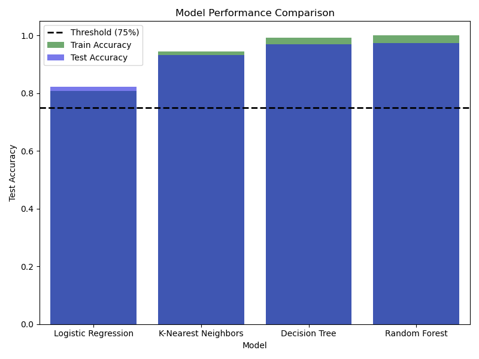
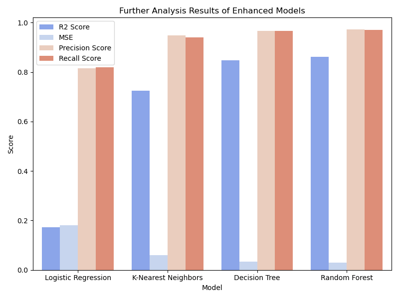

# Restaurant Success and Revenue Prediction
## Business Goal
There is always a demand for restaurants regardless of where you decide to live. Sometimes, restaurants will open with the plan of staying open for a long period of time, but it does not always work out. Restaurants can close just as quickly and have a new one take its place. The goal of this analysis is to develop a predictive model that can determine restaurant success based on various factors. This can help new restaurant owners in identifying what strategies to deploy and how to achieve success and longevity.

## Data
The Restaurant Success dataset from Kaggle includes 15 feature columns, 14 of which are useable for anaylsis. These features are both classified as categorical and numerical, and can be used to determine whether or not a restaurant would be a success. More info on this dataset can be found at [https://www.kaggle.com/datasets/liyangng/restaurant-success-prediction/data]

First I decided to look at a couple of the categorical features to determine whether something like location or cuisine type had any effect on restaurant success.

After having discovered no correlation between the categorical features, I took a closer look at what features exactly had a higher effect on restaurant success. From the heatmap and scatterplot shown below, I determined that Social Media Followers and Marketing Budget had the highest impact on a restuarant's success.

After this preliminary inspection, the data was split into training and test data.

## Modeling and Performance

In this project we employed various modeling techniques to classify whether a restaurant was successful, and to predict annual revenue. The models that were used for classification included `Logistic Regression`, `KNN`, `Decision Trees`, and `Random Forest`. The metrics that were used for comparisons for the classification models include Accuracy (train and test), R2 score, MSE, Precision Score, and Recall Score.

As shown in the figure above, the decision tree model and the random forest model performed significantly better than the dummy model, the logistic regression model, and the k-nearest neighbors model. When looking at the other metrics, we can clearly see that decision tree and random forest outperform both logistic regression and k-nearest neighbors by having a higher r2 score and lower MSE. This can be seen in the barplot below. In addition, all of the classification models recorded a precision score and a recall score over 80%. This is a great result as it proves the accuracy of the models in its ability to deem whether a restaurant to be successful or not.

After having done a first pass on these models, I used GridSearchCV to find the models best performance hyperparameters. The results can be seen in the following barplots.

 

The models that were used for regression included  `SVM`, `Linear Regression`, `Lasso`, and `Random Forest`.  The metrics that were used for comparisons for the regression models include Accuracy (train and test), R2 score, MSE, and MAE.

From these results, it seems that the models created were overfitted. Surprisingly, the Random Forest Regressor was the only model that had a high training accuracy. Otherwise, every other model resulted in a low training accuracy and low test accuracy. This proves to be consistent with the high MAE and MSE results and low R2 score. GridSearchCV was also applied to Random Forest Regressor and the Lasso Regressor, but there seemed to be little change to the results of the model. Despite the high overfitting results determined from these models, it does align with the original scatterplot picture above, as there seems to be little correlation between revenue and general restaurant success.

## Conclusions
These data provided for this project is intended for classification and can be used reliably to determine whether a restaurant to be successful or not. However, when it comes to predicting a restaurant's revenue, each model was continuously overfitted. This leads me to believe these are not the right parameters to properly predict a restuarant's revenue. 
